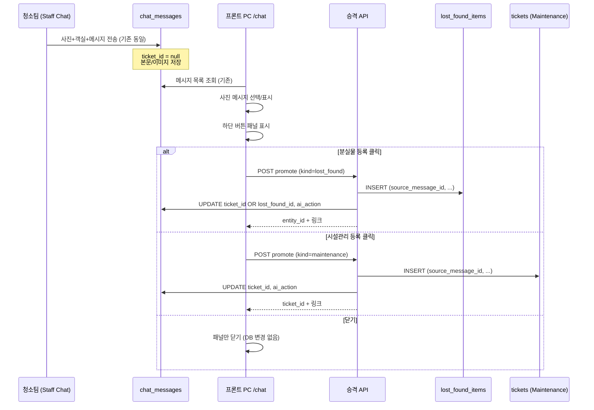
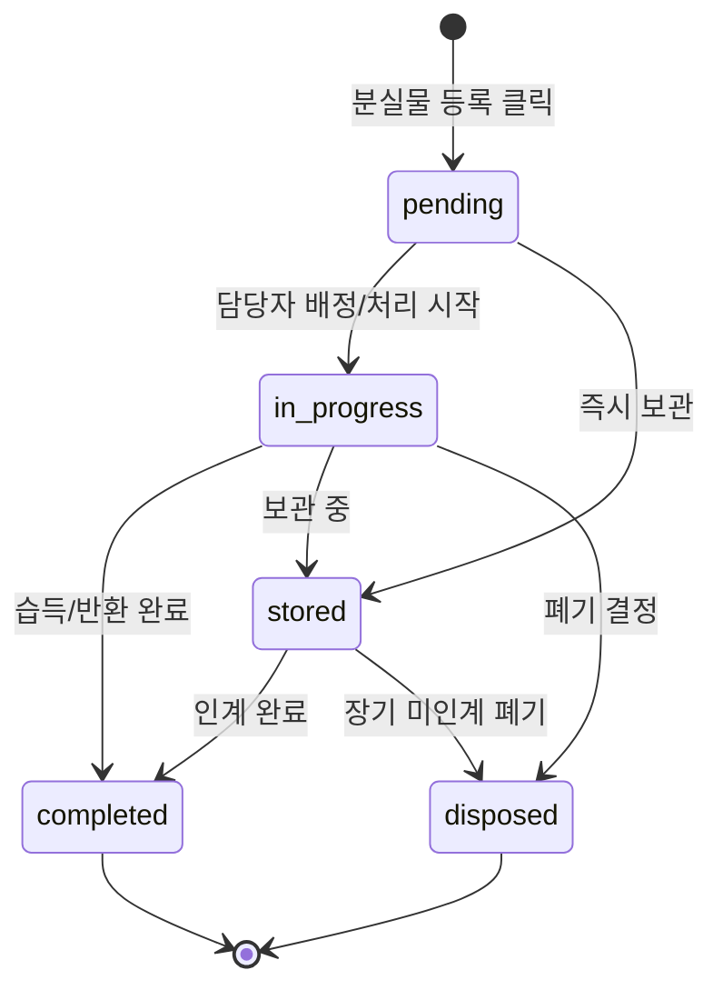
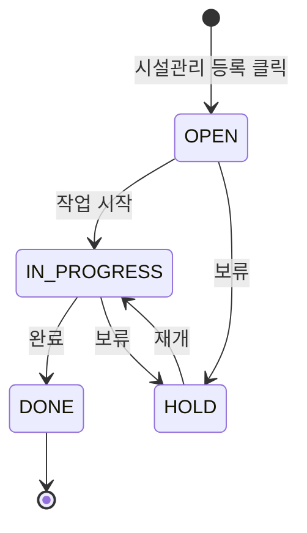
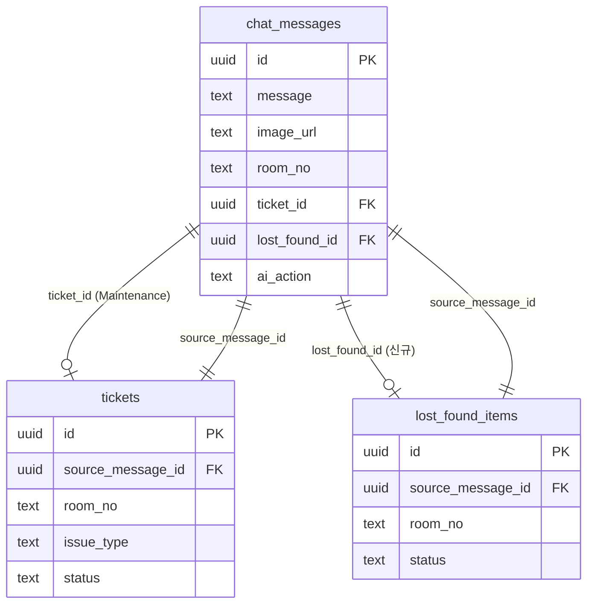

# 사진 메시지 → 업무(Ticket) 승격 MVP 설계

**문서 유형:** 기능 설계 (MVP)  
**작성 기준:** AutoFlow Engineering Constitution v1.0  
**구현 상태:** 설계만 — 코드/DB/API/UI 변경 없음  
**AI:** 본 MVP 범위 외 (사람이 버튼으로만 승격)

---

## 1. 배경 및 목표

### 1.1 문제

청소팀(Staff Chat)은 사진·객실번호·메시지를 기존 방식 그대로 전송한다.  
프론트(운영 PC `/chat`)는 해당 사진 메시지를 **증거(Evidence)** 로 보관하지만, 분실물·시설 이슈를 **업무(Action)** 로 승격하는 명시적 경로가 약하다.

- Staff 사진 메시지는 `chat_messages`에만 저장됨 (자동 Ticket 없음)
- PC 수동 티켓(`수동 티켓 생성`)은 존재하나 **이미지 미전달**, **분실물/시설 구분 없음**, overflow 메뉴에 숨김
- **LostFound(분실물) 엔티티는 코드베이스에 없음**

### 1.2 MVP 목표

| 원칙 | 내용 |
|------|------|
| 청소팀 무변경 | 사진·객실·메시지만. 새 버튼/입력/절차 금지 |
| 프론트만 변경 | PC `/chat`에서 사진 메시지 하단에 승격 버튼 3개만 |
| AI 금지 | 분류·자동등록·버튼 제안 없음 |
| Wrong Save 방지 | **버튼 클릭 후에만** DB 생성 |
| 채팅 원본 보존 | 본문/사진/삭제·이동 금지. Reference 필드만 갱신 |

### 1.3 핵심 개념

```
채팅(chat_messages) = 증거(Evidence) — 불변
Ticket               = 업무(Action)   — 별도 엔티티
연결                 = chat_message_id ↔ ticket_id (양방향 Reference)
```

---

## 2. 기존 구조 조사 (Production Proven Rule)

### 2.1 재사용 가능 자산

| 영역 | 존재 여부 | 경로/테이블 | 재사용 가능성 |
|------|-----------|-------------|---------------|
| **Maintenance Ticket** | ✅ | `public.tickets`, `lib/services/maintenance.ts` | **높음** — 시설관리 승격의 기반 |
| **채팅↔티켓 연결** | ✅ | `chat_messages.ticket_id`, `ai_action`, `POST /api/chat/manual-ticket` | **높음** — 승격 후 링크 패턴 검증됨 |
| **사진 저장** | ✅ | `chat_messages.image_url`, `image_storage_path`, `autoflow-photos` 버킷 | **높음** — 재업로드 없이 URL 참조 가능 |
| **객실 타임라인** | ✅ | `room_timeline` VIEW, `GET /api/rooms/[room_no]/timeline` | **중간** — Ticket 생성 시 자동 반영(기존 ticket 소스) |
| **운영메모** | △ | `message_intents.ops_note`, `rooms.notes`(미연동), `chat_ops_queue` | **낮음~중간** — MVP 직접 연동 불필요 |
| **LostFound** | ❌ | 없음 (quick phrase `lost_item`만) | **신규 설계 필요** |
| **투숙객/예약/전화** | ❌ | PMS 스키마 없음 | **Phase 2** — `room_no`+일자 매칭만 설계 |

### 2.2 현재 Ticket 스키마 (런타임: `tickets`)

코드 기준 추론 (`lib/services/maintenance.ts`, migrations):

| 컬럼 | 용도 |
|------|------|
| `id` | uuid PK |
| `room_no` | 객실 |
| `issue_type` | `설비\|전기\|가전\|침구\|청소\|기타` |
| `description` | 설명 |
| `status` | `OPEN\|IN_PROGRESS\|DONE\|HOLD` |
| `created_by` | 생성자 UUID (프론트 직원) |
| `created_at`, `updated_at` | |
| `source_message_id` | (대시보드 참조, DDL은 repo에 불완전) |

`ticket_events` — 상태 변경 감사 로그 존재.

### 2.3 현재 채팅 메시지 (증거)

`lib/types.ts` — `ChatMessage`:

- `room_no`, `image_url`, `image_storage_path`, `message`, `sender_name`, `token_id`
- `ticket_id`, `ai_action` — **Reference 전용** (본문 불변 전제와 양립)
- Staff 사진: `message_type: 'image'`, `sender_side: 'mobile'`

### 2.4 기존 “채팅→Ticket” 패턴

| 패턴 | 트리거 | 파일 | MVP 관계 |
|------|--------|------|----------|
| AI 자동 | `CHAT_ENABLE_AI_POSTPROCESS=1` | `app/api/chat/send/route.ts` | **사용 안 함** |
| PC 수동 2단계 | overflow `수동 티켓 생성` | `app/chat/page.tsx` → `maintenance/create` + `manual-ticket` | **시설관리 참고** |
| 유지보수 폼 | PC 채팅 하단 패널 | `app/chat/page.tsx` | 별도 흐름 |

**Gap:** 수동 티켓은 `image_url` 미전달, `prompt`로 객실/유형 입력, 분실물 미지원.

### 2.5 Staff Chat (변경 금지)

- `app/staff-chat/StaffChatClient.tsx` — 사진 전송만
- Ticket 생성/버튼 **추가하지 않음**

---

## 3. MVP 범위

### 3.1 In Scope

| # | 항목 |
|---|------|
| 1 | PC `/chat`에서 **사진 포함** 메시지 하단 UI: `분실물 등록` / `시설관리 등록` / `닫기` |
| 2 | 버튼 클릭 시 각각 LostFound / Maintenance Ticket 생성 + `chat_message_id` 연결 |
| 3 | 채팅 본문·이미지 불변; `ticket_id`, `ai_action` Reference만 갱신 |
| 4 | 이미 승격된 메시지(`ticket_id` 존재)에는 승격 버튼 미표시 |
| 5 | 생성 후 `티켓 보기` 링크 (기존 `ChatMessages` 패턴 재사용) |

### 3.2 Out of Scope (MVP)

- Staff Chat UI/플로우 변경
- AI 분류·자동 Ticket·버튼 제안
- 투숙객/예약/전화 **자동 연결 구현** (조사·설계만)
- 운영메모·객실이력 **자동 생성 구현** (데이터 흐름 설계만)
- Dashboard/Front-ops 대규모 개편

---

## 4. 전체 업무 흐름도



**Wrong Save 방지 체크포인트**

1. `ticket_id` / `lost_found_id` 이미 있으면 → API 409, UI 버튼 숨김  
2. 버튼 클릭 전 → DB에 Ticket 행 없음  
3. 서버에서 `message_id` 재검증 (존재, image 있음, 미연결)

---

## 5. 화면 흐름 (프론트 PC `/chat`만)

### 5.1 진입 조건 (버튼 패널 표시)

| 조건 | 설명 |
|------|------|
| `msg.image_url` 존재 | 사진 메시지 |
| `!msg.ticket_id && !msg.lost_found_id` | 미승격 |
| `!msg.is_deleted` | 삭제 메시지 제외 |
| PC 뷰어 | `sender_side` 무관 (Staff 사진을 PC에서 승격) |

**표시 방식 (설계안):**  
메시지 행 포커스/탭 시 사진 **아래** 인라인 패널 (기존 overflow `수동 티켓 생성` 대체·MVP에서는 사진에만 한정)

```
┌─────────────────────────────┐
│ 🏠 607호                     │
│ [사진 썸네일]                │
│ 607호 청소완료               │
├─────────────────────────────┤
│ [ 분실물 등록 ]              │
│ [ 시설관리 등록 ]            │
│ [ 닫기 ]                     │
└─────────────────────────────┘
```

`닫기` — 패널만 닫음. 채팅·DB 무변경.

### 5.2 승격 후

- 패널 닫힘
- `AiActionBadge` + `티켓 보기` / `분실물 보기` (기존 maintenance 링크 패턴 확장)
- `ai_action` 후보:
  - `ticket_created_manual` (시설, 기존 값 재사용)
  - `lost_found_created_manual` (**신규 enum**, 설계만)

### 5.3 관련 화면 (이동)

| 엔티티 | 생성 후 이동 | 기존 화면 |
|--------|--------------|-----------|
| Maintenance | `/maintenance/[id]` | ✅ 존재 |
| LostFound | `/lost-found/[id]` (신규) 또는 `/dashboard` 필터 | ❌ 신규 필요 (Phase 구현) |

MVP 구현 단계에서 LostFound 상세는 **최소 목록+상태 변경**만 권장.

---

## 6. LostFound 설계

### 6.1 엔티티 정의

**채팅의 복사본이 아닌 업무 엔티티.**  
증거는 `source_message_id`로만 참조.

### 6.2 DB 설계 초안 — `lost_found_items` (신규 테이블 권장)

`issue_type: '분실물'`을 `tickets`에 넣는 대안도 있으나, 상태(보관·폐기)와 수명주기가 다르므로 **별도 테이블 권장**.

| 컬럼 | 타입 | 필수 | 설명 |
|------|------|------|------|
| `id` | uuid PK | ✅ | |
| `source_message_id` | uuid FK → chat_messages | ✅ | **증거 연결 (불변)** |
| `room_no` | text | ✅ | 메시지에서 복사 |
| `photo_url` | text | △ | `chat_messages.image_url` 스냅샷 또는 참조 |
| `photo_storage_path` | text | △ | 동일 |
| `description` | text | △ | 캡션/메시지 본문 스냅샷 |
| `status` | text | ✅ | 아래 상태 enum |
| `found_at` | timestamptz | △ | 메시지 `created_at` 기본값 |
| `reported_by_user_id` | uuid | △ | 발신 staff `user_id` |
| `reported_by_name` | text | △ | `sender_name` |
| `handled_by` | uuid | △ | 승격 클릭한 프론트 직원 |
| `guest_name` | text | null | Phase 2 자동 연결용 |
| `guest_phone` | text | null | Phase 2 |
| `reservation_no` | text | null | Phase 2 |
| `notes` | text | null | 운영 메모 |
| `created_at` | timestamptz | ✅ | |
| `updated_at` | timestamptz | ✅ | |
| `closed_at` | timestamptz | null | 완료/폐기 시 |

**채팅 측 Reference (구현 단계):**

- `chat_messages.lost_found_id` uuid null **또는**
- 단일 `ticket_id`만 유지하고 `tickets.ticket_kind`로 구분 — **비권장** (도메인 혼합)

권장: `chat_messages`에 `lost_found_id` 추가 + `ticket_id`는 Maintenance 전용 유지.

### 6.3 상태 (State)



| DB 값 | 한글 | 설명 |
|-------|------|------|
| `pending` | 대기 | 방금 승격됨 |
| `in_progress` | 처리중 | 연락·조사 중 |
| `completed` | 완료 | 반환/종결 |
| `stored` | 보관 | 프론트/보관실 보관 |
| `disposed` | 폐기 | 인계 불가 종료 |

### 6.4 생성 플로우

1. 프론트: `분실물 등록` 클릭  
2. 서버: `chat_messages` 로드 → `image_url`, `room_no`, `message`, `user_id`, `sender_name`, `created_at` 추출  
3. `lost_found_items` INSERT (`status=pending`, `handled_by=현재 로그인 직원`)  
4. `chat_messages` UPDATE **Reference만**: `lost_found_id`, `ai_action=lost_found_created_manual`  
5. (선택) `room_timeline` VIEW에 `source_type=lost_found` UNION 추가 — **구현 Phase**

### 6.5 투숙객 자동 연결 — 조사 결과 (구현 금지, 설계만)

| 데이터 | 현재 | 자동 연결 가능성 |
|--------|------|------------------|
| 현재 숙박객 | **없음** | `room_no` + `found_at` 날짜로 PMS 연동 시 가능 — **Phase 2** |
| 전화번호 | **없음** | 예약/체크인 테이블 필요 |
| 예약번호 | **없음** | OTA/PMS API 필요 |

**MVP 설계:** `guest_*` 컬럼은 nullable. UI에 “연결된 투숙객 없음” 표시.  
**Phase 2:** `room_stays(room_no, check_in, check_out, guest_name, phone, reservation_no)` + 승격 시점 매칭 job.

---

## 7. Maintenance (시설관리) 설계

### 7.1 재사용 전략

**기존 `tickets` + `createTicket` + `manual-ticket` 패턴 최대 재사용** (Production Proven).

### 7.2 DB — 추가 컬럼 후보 (구현 Phase)

| 컬럼 | 목적 |
|------|------|
| `source_message_id` | chat_messages.id (공식화) |
| `photo_url` | 증거 사진 참조 (chat에서 복사, 재업로드 불필요) |
| `photo_storage_path` | 동일 |
| `promoted_by` | 승격한 프론트 직원 |

현재 `createTicket`은 ticket row에 image 미저장, mock에서만 system chat에 image 부여.

### 7.3 상태 (State) — 기존 유지



| DB | 앱 표시 |
|----|---------|
| `OPEN` | 대기 |
| `IN_PROGRESS` | 처리중 |
| `DONE` | 완료 |
| `HOLD` | 보류 |

### 7.4 생성 플로우 (권장: 단일 승격 API)

1. `시설관리 등록` 클릭  
2. 서버가 메시지에서 자동 채움:
   - `room_no`, `description`(캡션), `photo_url`
   - `issue_type` 기본값 `설비` (MVP에서 prompt 없음 — **Wrong Save와 단순화 trade-off**)
   - `created_by` = 프론트 직원 UUID
   - `source_message_id` = message.id
3. `tickets` INSERT  
4. `chat_messages` UPDATE: `ticket_id`, `ai_action=ticket_created_manual`  
5. **새 system chat 메시지 생성 안 함** (기존 `createTicket`의 “🔧 접수됨” 메시지는 MVP에서 **비활성 옵션** 검토 — 증거 채팅 오염 방지)

### 7.5 연관 데이터 흐름 (구현 금지, 설계만)

| 대상 | 연결 방식 |
|------|-----------|
| **객실 시설이력** | `room_timeline`에 이미 `source_type=ticket` 포함 → 추가 작업 최소 |
| **운영메모** | 승격 시 `rooms.notes` append **또는** `ops_note` intent 생성 — **Phase 2** (MVP 자동 생성 안 함) |
| **유지보수 현황** | `/maintenance`, `/dashboard` 기존 목록에 자동 노출 |

---

## 8. 채팅 ↔ Ticket Reference 구조



### 8.1 양방향 탐색

| 방향 | 방법 |
|------|------|
| 채팅 → Ticket | `chat_messages.ticket_id` / `lost_found_id` |
| Ticket → 채팅 | `tickets.source_message_id` / `lost_found_items.source_message_id` |
| Ticket → 객실 이력 | `room_timeline` WHERE `reference_id` = ticket.id |
| 채팅 목록 (Ticket 스레드) | 기존 `GET /api/chat/list?ticket_id=` |

### 8.2 채팅 불변 원칙 (정의)

| 허용 | 금지 |
|------|------|
| `ticket_id`, `lost_found_id`, `ai_action` 갱신 | `message`, `image_url` 수정 |
| soft delete 기존 정책 유지 | 승격을 위한 메시지 이동/병합 |
| Reference 추가 | 증거 사진 재업로드로 덮어쓰기 |

---

## 9. API 후보 (구현 Phase — 설계만)

### 9.1 권장: 통합 승격 API

```
POST /api/chat/promote-from-message
```

**Body (JSON):**

```json
{
  "message_id": "uuid",
  "kind": "lost_found" | "maintenance",
  "actor_user_id": "uuid"
}
```

**서버 동작:**

1. 메시지 잠금/검증 (image, 미연결)
2. kind별 분기 INSERT
3. chat_messages Reference UPDATE
4. `{ entity_type, entity_id, chat_message }` 반환

**장점:** 원자적 트랜잭션, Wrong Save 단일 관문, 프론트 1회 호출.

### 9.2 대안: 기존 API 2단계 (시설만)

- `POST /api/maintenance/create` + `POST /api/chat/manual-ticket`
- 분실물은 신규 API 필수
- 이미지: `image_url` 전달 필드 추가 필요

### 9.3 조회 API 후보

| API | 용도 |
|-----|------|
| `GET /api/lost-found/[id]` | 분실물 상세 |
| `GET /api/lost-found?room_no=&status=` | 목록 |
| `PATCH /api/lost-found/[id]/status` | 상태 전이 |
| 기존 `GET /api/maintenance/[id]` | 시설 상세 |
| `GET /api/chat/list?lost_found_id=` | (선택) 연결 메시지 |

---

## 10. 자동 입력 매핑

| 필드 | 소스 (`chat_messages`) | LostFound | Maintenance |
|------|--------------------------|-----------|-------------|
| chat_message_id | `id` | `source_message_id` | `source_message_id` |
| room_no | `room_no` | ✅ | ✅ |
| photo | `image_url`, `image_storage_path` | ✅ | ✅ |
| created_at | `created_at` | `found_at` | ticket `created_at` |
| sender | `user_id`, `sender_name` | `reported_by_*` | description 메타 |
| 담당 직원 | — | `handled_by` (클릭자) | `created_by` / `promoted_by` |
| description | `message` | ✅ | ✅ |
| issue_type | — | — | default `설비` |

---

## 11. 회귀 위험

| 위험 | 수준 | 완화 |
|------|------|------|
| Staff Chat 동작 변경 | **없음** (UI 미접촉) | Staff 파일 수정 금지 유지 |
| 기존 AI 자동 Ticket | **낮음** | `CHAT_ENABLE_AI_POSTPROCESS` 기본 off 유지 |
| `createTicket` system 메시지 중복 | **중간** | promote API에서 system chat 생성 스킵 옵션 |
| `ticket_id` 이중 연결 | **중간** | 서버 unique check, UI에서 승격 버튼 숨김 |
| `room_timeline` 누락 (LostFound) | **낮음** | VIEW 확장은 독립 migration |
| 수동 티켓 overflow 메뉴 중복 | **낮음** | 사진 메시지는 새 패널만; 텍스트는 기존 유지 또는 통합 검토 |
| image 재업로드 실패 | **낮음** | URL 참조만; 새 upload 없음 |
| PMS 없이 guest 컬럼 기대 | **낮음** | nullable + UI “미연결” |

---

## 12. MVP vs Phase 2

### Phase 1 (본 MVP)

- PC `/chat` 사진 하단 3버튼
- LostFound 테이블 + promote API
- Maintenance promote (기존 tickets 재사용)
- Reference 연결 + 티켓 보기 링크
- 최소 LostFound 목록/상태 화면

### Phase 2 (AI 보조 — 본 문서 구현 제외)

| 기능 | 설명 |
|------|------|
| AI 분류 **제안** | “시설 이슈로 보입니다” **텍스트만**, 자동 등록 없음 |
| 투숙객 자동 매칭 | PMS/`room_stays` 연동 |
| 운영메모 자동 초안 | `rooms.notes` 또는 `ops_note` |
| 중복 승격 감지 | 동일 사진/객실 기존 Ticket 알림 |
| Front-ops 카드 연동 | `photo_report` → 승격 완료 상태 동기화 |
| `issue_type` AI 추천 | 버튼 대체 아님, 클릭 후 폼 prefill만 |

**AI 삽입 위치 (미래):**

```
[사진 메시지]
  └─ (Phase 2) 힌트 텍스트 only
  └─ [분실물 등록] [시설관리 등록] [닫기]  ← 사람 클릭 (변경 없음)
```

---

## 13. 구현 시 변경 파일 예상 (참고 — 본 단계 착수 안 함)

| 레이어 | 파일 (예상) |
|--------|-------------|
| UI | `components/ChatMessages.tsx`, `app/chat/page.tsx` |
| API | `app/api/chat/promote-from-message/route.ts` (신규) |
| Service | `lib/services/lostFound.ts` (신규), `lib/services/maintenance.ts` (소폭) |
| DB | migration: `lost_found_items`, `chat_messages.lost_found_id`, `tickets.source_message_id` |
| Types | `lib/types.ts` — `AiAction`, `LostFoundItem` |
| **변경 없음** | `app/staff-chat/**`, AI parser, FCM, Tauri, Android |

---

## 14. 설계 결정 요약

| 결정 | 선택 | 이유 |
|------|------|------|
| LostFound 저장소 | **신규 테이블** | 보관·폐기 수명주기, Maintenance와 분리 |
| Maintenance | **`tickets` 재사용** | Production Proven |
| 승격 트리거 | **프론트 버튼만** | Wrong Save, AI 금지 |
| 채팅 변경 | **Reference 필드만** | 증거 불변 원칙 |
| 청소팀 | **무변경** | Constitution |
| API 형태 | **단일 promote API 권장** | 원자성 + 분실물/시설 대칭 |
| 투숙객 연결 | **Phase 2** | 현재 스키마 없음 |

---

## 15. 승인 체크리스트 (구현 착수 전)

- [ ] LostFound 별도 테이블 vs `tickets` 통합 최종 승인
- [ ] Maintenance `issue_type` MVP 기본값 (`설비` 고정 vs 1회 선택)
- [ ] `createTicket` system chat 메시지 생성 여부
- [ ] `chat_messages.lost_found_id` 컬럼 추가 승인
- [ ] LostFound 상세 화면 라우트 (`/lost-found`) 승인
- [ ] 기존 overflow `수동 티켓 생성`과의 공존/통합 정책

---

*본 문서는 조사·설계 산출물이며, 구현·DB 마이그레이션·API 배포는 별도 승인 후 진행한다.*
